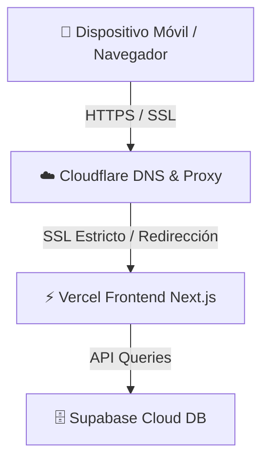

# Guía de Despliegue, Dominios Gratuitos y Seguridad (Costo 0)

Esta guía detalla el procedimiento para alojar **OnProduction ERP** de manera segura, con HTTPS de extremo a extremo, mitigación de ataques y un subdominio personalizado de nivel superior (`.is-a.dev`), todo **sin costo alguno**.

---

## Componentes del Stack de Despliegue



1. **Vercel** (Alojamiento Frontend - Gratis)
2. **Supabase Cloud** (Base de Datos & Edge Functions - Gratis)
3. **Cloudflare** (Gestión de DNS, SSL/TLS, Minificación y DDoS - Gratis)
4. **is-a.dev** (Registro del Subdominio de Desarrollador - Gratis)

---

## Paso 1: Configurar el Hosting del Frontend en Vercel

1. Ve a [Vercel](https://vercel.com) e inicia sesión con tu cuenta de GitHub.
2. Haz clic en **Add New -> Project**.
3. Importa el repositorio de **OnProduction**.
4. En **Framework Preset**, Vercel detectará automáticamente **Next.js**.
5. En **Root Directory**, selecciona la carpeta `frontend` si tu repositorio tiene múltiples carpetas en la raíz.
6. En **Environment Variables**, agrega las variables de entorno de tu archivo `frontend/.env.local` (como las URLs y llaves anónimas de Supabase).
7. Haz clic en **Deploy**. 
   * Vercel te dará una URL por defecto similar a `onproduction-app.vercel.app`.

---

## Paso 2: Registrar tu Subdominio Gratis (`.is-a.dev`)

El servicio **is-a.dev** ofrece subdominios gratuitos para desarrolladores mediante pull requests de GitHub.

1. Abre tu cuenta de GitHub y ve a [github.com/is-a-dev/register](https://github.com/is-a-dev/register).
2. Haz un **Fork** de ese repositorio a tu cuenta personal.
3. En tu fork, entra a la carpeta `domains/`.
4. Crea un nuevo archivo llamado `<tu-subdominio>.json` (por ejemplo, `onproduction.json`).
5. El contenido del archivo debe configurar tus servidores de nombres de **Cloudflare** (los obtendremos en el Paso 3). Ejemplo del archivo JSON:
   ```json
   {
     "owner": {
       "username": "tu-usuario-de-github",
       "email": "tu-correo@ejemplo.com"
     },
     "record": {
       "NS": [
         "alec.ns.cloudflare.com",
         "heather.ns.cloudflare.com"
       ]
     }
   }
   ```
6. Guarda el archivo, realiza el commit y haz un **Pull Request** hacia el repositorio principal.
7. Un bot validará el archivo de forma automática y en pocos minutos tu PR será aprobado y mezclado (*merged*). ¡Tu subdominio ya estará registrado!

---

## Paso 3: Configurar Cloudflare (DNS, SSL y DDoS)

Cloudflare actuará como escudo protector para tu sitio y gestionará la redirección hacia Vercel de forma ultra rápida.

1. Regístrate de forma gratuita en [Cloudflare](https://dash.cloudflare.com/).
2. Haz clic en **Add a Site** e ingresa el dominio completo que registraste (ej: `onproduction.is-a.dev`). Selecciona el **Plan Gratuito ($0)**.
3. Cloudflare te asignará dos **Name Servers** (ejemplo: `alec.ns.cloudflare.com` y `heather.ns.cloudflare.com`). **Copia estos servidores e insértalos en el JSON del Paso 2**.
4. Una vez que tu Pull Request en `is-a.dev` sea aprobado, Cloudflare detectará el dominio.
5. En el panel de control de Cloudflare, ve a la sección **SSL/TLS -> Overview** y selecciona el modo **Full (Strict)**. Esto asegura que la comunicación entre Cloudflare y Vercel esté encriptada.
6. Ve a la pestaña **DNS -> Records** y añade el registro CNAME para conectar con Vercel:
   - **Type**: `CNAME`
   - **Name**: `@` (o `onproduction`)
   - **Target**: `cname.vercel-dns.com`
   - **Proxy status**: Habilitado (Nube naranja activa)

---

## Paso 4: Vincular el Dominio en Vercel

1. En el dashboard de tu proyecto en Vercel, ve a **Settings -> Domains**.
2. Escribe tu dominio completo (ej: `onproduction.is-a.dev`) y haz clic en **Add**.
3. Selecciona la opción recomendada (redireccionar el dominio sin `www` al principal).
4. Vercel comprobará si los registros DNS apuntan correctamente a sus servidores. Como estás utilizando Cloudflare, la validación se completará rápidamente y Vercel generará el certificado SSL correspondiente.
5. Si Vercel te pide una verificación adicional, te proporcionará un registro `TXT`. Solo debes ir a **Cloudflare -> DNS -> Records**, añadir un registro de tipo `TXT` con el nombre y valor proporcionados por Vercel, y esperar unos minutos.

---

## Paso 5: Probar la Aplicación en el Celular (PWA)

Una vez completado el despliegue:

1. Entra a tu dominio `https://onproduction.is-a.dev` desde tu teléfono móvil.
2. **En iOS (Safari)**:
   - Presiona el botón de **Compartir** (icono de la caja con la flecha hacia arriba).
   - Desplázate hacia abajo y selecciona **Añadir a pantalla de inicio**.
   - Verás el icono degradado de OnProduction y se abrirá en pantalla completa standalone (sin barra de direcciones de Safari).
3. **En Android (Chrome)**:
   - Aparecerá un banner automático en la parte inferior sugiriendo **Añadir OnProduction a la pantalla de inicio** (o puedes pulsar los tres puntos superiores y seleccionar **Instalar aplicación**).
   - Se creará un acceso directo con soporte offline gracias a los Service Workers configurados.
