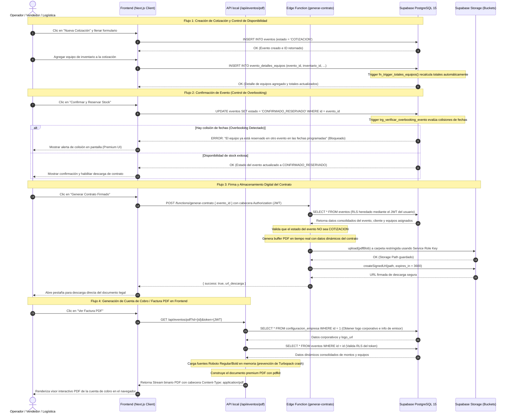

# Diagrama de Secuencia del Sistema (Interacción Tecnológica)

Este diagrama modela la interacción secuencial entre los usuarios del sistema, la aplicación web (Next.js), las APIs locales, los servicios de la base de datos de Supabase, Edge Functions y el almacenamiento persistente.

---

## Ficha Técnica de Integración Tecnológica

| Componente | Detalle / Configuración |
| :--- | :--- |
| **URL del Diagrama** | `diagramas/diagrama_secuencia.md` (Accesible localmente en el repositorio) |
| **Sistemas Involucrados** | • Cliente Web Next.js 15+ (React) • Edge Functions de Supabase (Runtime Deno v1.168+) • Base de datos Supabase PostgreSQL 15 |
| **APIs Involucradas** | • `/api/eventos/pdf` (Endpoint interno en Next.js App Router para facturación PDF) • Supabase REST API (PostgREST para consultas directas desde el cliente) • Deno Function Endpoint `https://[SUPABASE_PROJECT_ID].supabase.co/functions/v1/generar-contrato` |
| **Servicios Externos** | • Supabase Storage (Bucket restringido `contratos` para almacenamiento seguro de PDF firmados) • CDN de Cloudflare/Cdnjs (para descarga resiliente de fuentes en runtime) |
| **Bases de Datos Impactadas** | **Supabase PostgreSQL**: • Tabla `eventos` • Tabla `evento_detalles_equipos` • Tabla `evento_adicionales` • Tabla `configuracion_empresa` |
