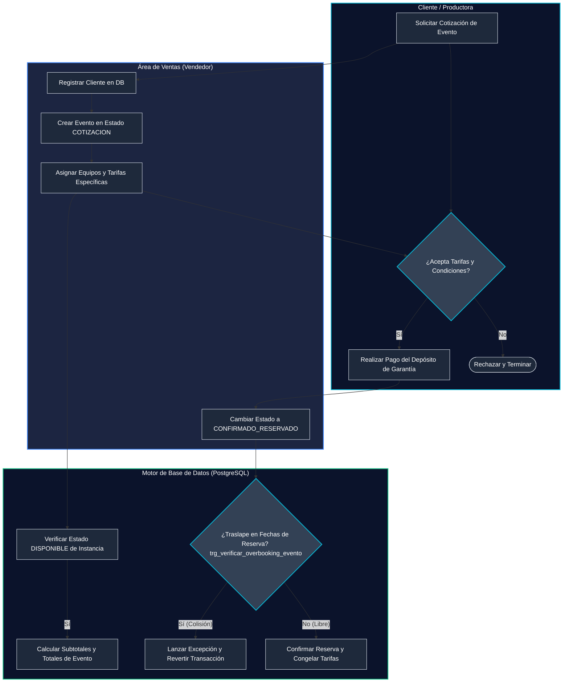
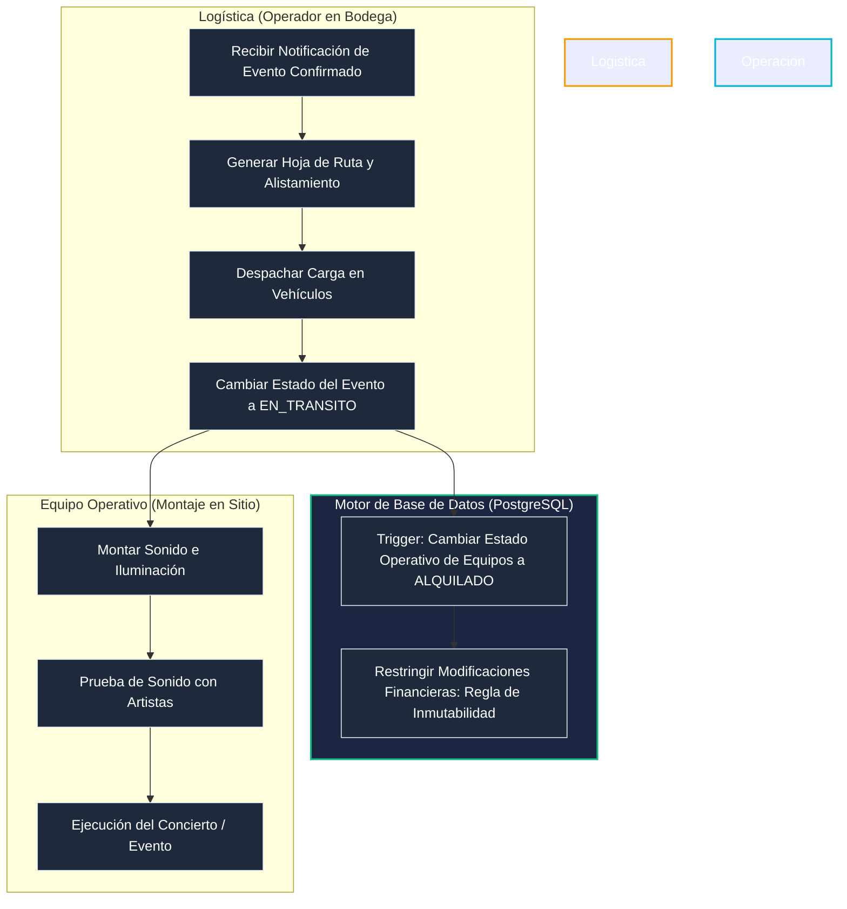
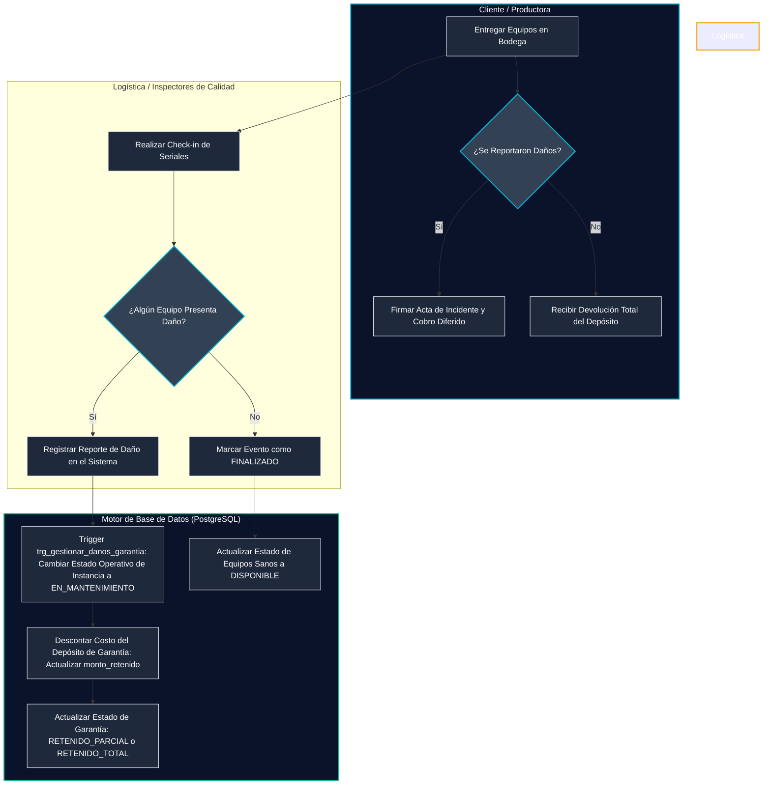
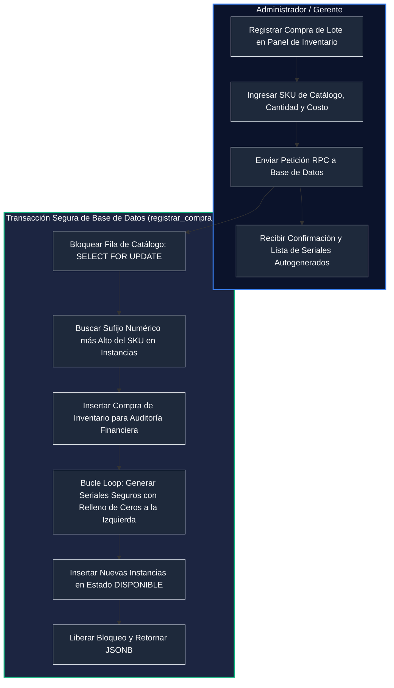

# Listado y Modelado de Flujos de Secuencia Críticos

Este documento consolida y describe los flujos de secuencia y de control transaccional del sistema **OnProduction**, estructurados mediante Swimlanes funcionales y diagramas de secuencia avanzados.

---

## Índice de Flujos Modelados

1. [FS-01: Proceso de Cotización, Validación y Reserva de Inventario](#fs-01-proceso-de-cotización-validación-y-reserva-de-inventario)
2. [FS-02: Flujo Logístico de Despacho, Alquiler y Operación en Campo](#fs-02-flujo-logístico-de-despacho-alquiler-y-operación-en-campo)
3. [FS-03: Proceso de Retorno de Equipos, Reporte de Daños y Liquidación de Garantías](#fs-03-proceso-de-retorno-de-equipos-reporte-de-daños-y-liquidación-de-garantías)
4. [FS-04: Gestión Administrativa de Compras de Lote e Ingreso Seguro de Seriales](#fs-04-gestión-administrativa-de-compras-de-lote-e-ingreso-seguro-de-seriales)

---

## FS-01: Proceso de Cotización, Validación y Reserva de Inventario

Este flujo describe cómo un Vendedor registra la solicitud de un cliente, asigna los equipos verificando disponibilidad en vivo y realiza la transición a Confirmado, donde el motor de base de datos valida preventivamente el overbooking.

---

## FS-02: Flujo Logístico de Despacho, Alquiler y Operación en Campo

Describe el ciclo físico y de estados de los equipos de sonido, luces y montaje en tránsito desde la bodega hasta el lugar del evento.

---

## FS-03: Proceso de Retorno de Equipos, Reporte de Daños y Liquidación de Garantías

Este es el flujo crítico de auditoría técnica y financiera donde los equipos regresan y se evalúan daños.

---

## FS-04: Gestión Administrativa de Compras de Lote e Ingreso Seguro de Seriales

Representa el proceso donde se adquieren nuevos equipos y se insertan concurrentemente en la base de datos controlando duplicados de seriales tag correlativos.

